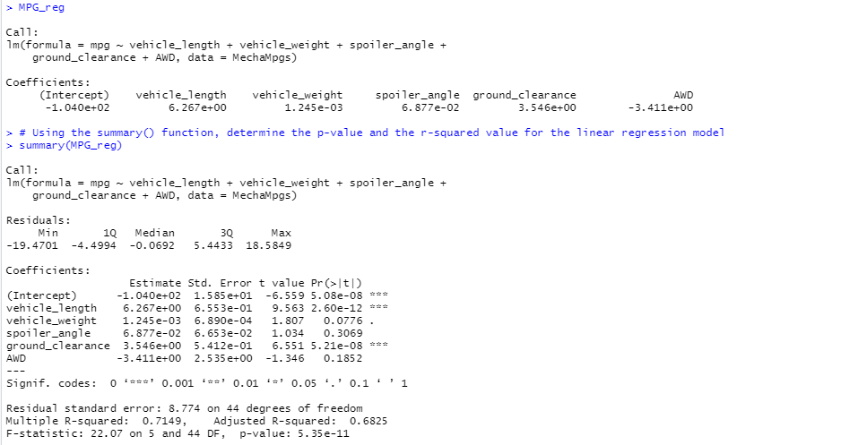
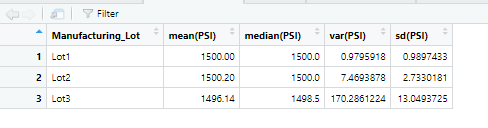
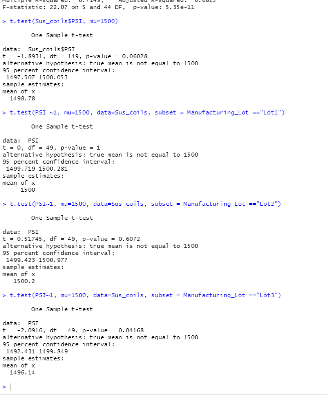

# MechaCar_Statistical_Analysis
## R unit project: Car Mechanical Data
### Project Overview
The objective for this project was to use data to assist the decision makers at "AutosRUs," a new car manufacturer, in adressing problems with a new vehicle prototype known as the MechaCar. First, linear regression with multiple variables was used to determine which design factors contribute most directly to the fuel efficiency of a vehicle. Then, two tests were used to determine the nature of problems with the manufacturing of the vehicles' suspensions, in an effort to identify whether any of the three manufactured lots were particularly problematic. Lastly, some further testing is described that would help compare the MechaCar to its competition.

## Analysis
## Linear Regression to Predict MPG
The linear regression on the prototypes' MPG values produced the following output:

From the regression, it appears that the length of the vehicle and the ground clearance of the vehicle each have a statistically significant relationship to MPG.

The slope of the linear regression is not considered to be zero, because the p-value associated with the F statistic is on the order of 10 ^ -11.

The regression gave an R^2 value of 0.71, meaning that the model accounts for about 70% of the variation in MPG. This indicates that it is reasonably effective in predicting the MPG of the prototypes.

## Summary Statistics on Suspension Coils
The overall dataset of suspension coils had the following statistics:

Divided into manufacturing lots, the statistics were as follows:

Although all three lots were similar in their mean and median PSI ratings, the later lot numbers showed greater variation compared to lot 1. In particular, Lot 3 fails the design specifications, because its variance is 170 PSI, which is well above the cutoff of 100.

## T-Tests on Suspension Coils
Significance testing on the manufactured lots of coils produced the following output:

The prototype suspensions overall, as well as manufacturing lots 1 and 2, did not show a significant difference from the standard 1500 PSI rating at the 5% significance level. Lot 3, however, came in with a mean of 1496.14 and p-value of 0.04, giving statistically significant evidence that the population PSI rating in lot 3 was not the same as the mean population.

## Study Design: MechaCar vs Competition

One area where the MechaCar could be compared to its competition would be its 60-0 braking distance, an important safety feature for avoiding high-speed collisions. This could be tested using the average distance the MechaCar travels in a series of braking tests, compared to the distance traveled by the competitor in the same number of tests under the same conditions. In this test, the null hypothesis would be that the mean braking distances of the two cars would be the same. Because the objective is to demonstrate that the brakes on the MechaCar are more effective, and a difference in the other direction would in fact be an unfortunate outcome, a one-tailed test would be appropriate here. Specifically, the alternate hypothesis would be that the mean stopping distance for a MechaCar would be less than the mean stopping distance for a competitor, showing that the brakes of the MechaCar were more effective. This would be a comparison of two sample means, which generally supports the use of a two-sample t-test. The required data would simply be lists of tests results, measuring how far each car traveled while decelerating from 60 mph to a full stop in a series of trials under the same conditions.